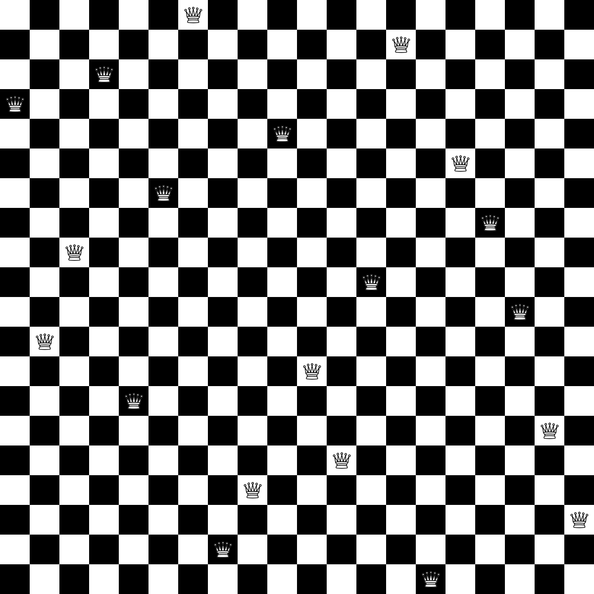

# N Queens puzzle recursive search

This is a program that adapts the [8 queens puzzle](https://en.wikipedia.org/wiki/Eight_queens_puzzle) to arbitrary NxN board with N queens.

from [8 queens puzzle]([https://en.wikipedia.org/wiki/Eight_queens_puzzle](https://en.wikipedia.org/wiki/Eight_queens_puzzle):

> The eight queens puzzle is an example of the more general ***n* queens problem** of placing *n* non-attacking queens on an *n*×*n* chessboard, for which solutions exist for all natural numbers *n* with the exception of *n* = 2 and *n* = 3.

# Usage

```bash
python3 queens.py -h
usage: queens.py [-h] [-n] [-o OUTPUT] [size]

Program to compute a random N queens solution.

positional arguments:
  size                  Board size and number of queens, default is 20

optional arguments:
  -h, --help            show this help message and exit
  -n, --no-display      Donot display, just save
  -o OUTPUT, --output OUTPUT
                        Output image name, default out.png
```

# Demo

```bash
python3 queens.py 20 -n -o out.jpg
```


